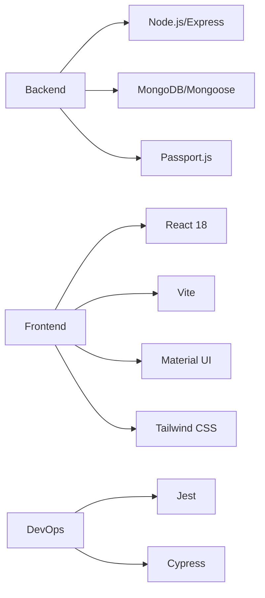
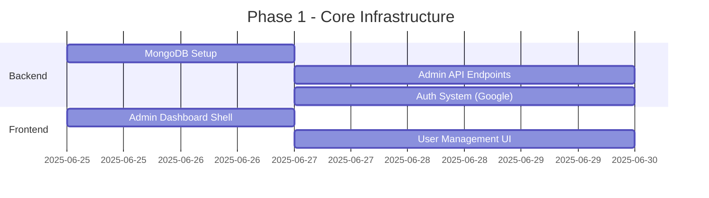
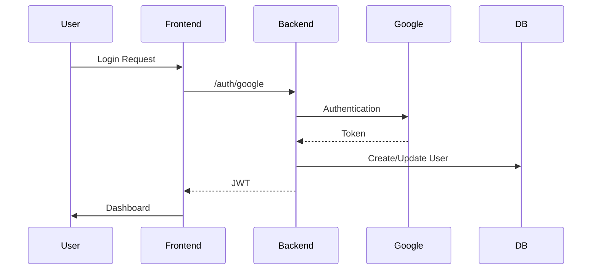

# Project Plan: Authentication Member Site (ERP Phase 1)

## Overview
Build a secure authentication system for an e-commerce ERP with:
- Google OAuth login
- Email/password fallback
- User roles (free, paid, admin)
- Admin dashboard for user management

## Technology Stack


## Database Schema
```javascript
// models/User.js
{
  email: { type: String, unique: true },
  password: { type: String }, // hashed
  role: { 
    type: String, 
    enum: ['free', 'paid', 'admin'],
    default: 'free'
  },
  authProvider: {
    type: String,
    enum: ['google', 'email'],
    required: true
  },
  createdAt: { type: Date, default: Date.now },
  lastLogin: Date
}
```

## Implementation Phases

### Phase 1: Core Infrastructure (Priority)


### Phase 2: Authentication


### Phase 3: User Features
- Membership upgrade flow
- Free tier feature set
- Paid tier feature set
- Profile management

## Testing Strategy
| Test Type       | Tools          | Coverage Goal |
|-----------------|----------------|---------------|
| Unit Testing    | Jest           | 80%           |
| Integration     | Supertest      | 100% Routes   |
| E2E             | Cypress        | Critical Paths|
| Security        | OWASP ZAP      | High Risk     |

## Deployment Plan
1. Development: Local MongoDB
2. Staging: Atlas free tier
3. Production: Atlas paid cluster

## Next Steps
1. Set up project structure
2. Install dependencies
3. Implement MongoDB connection
4. Create admin dashboard skeleton